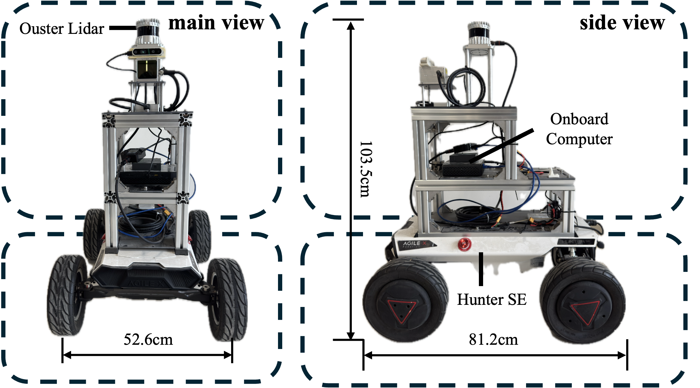
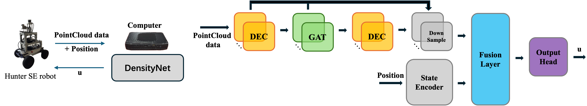
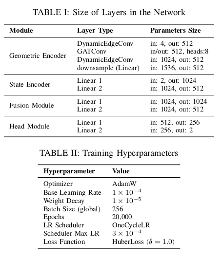
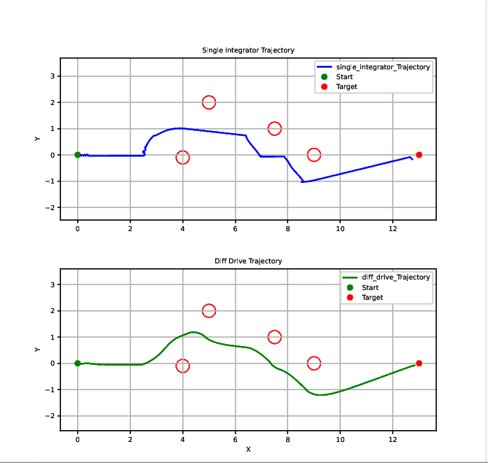
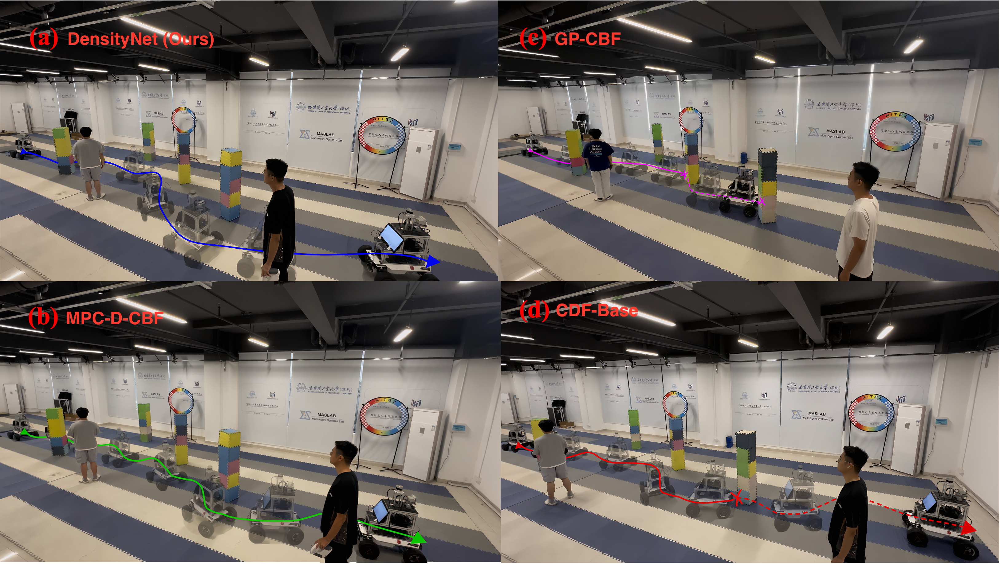
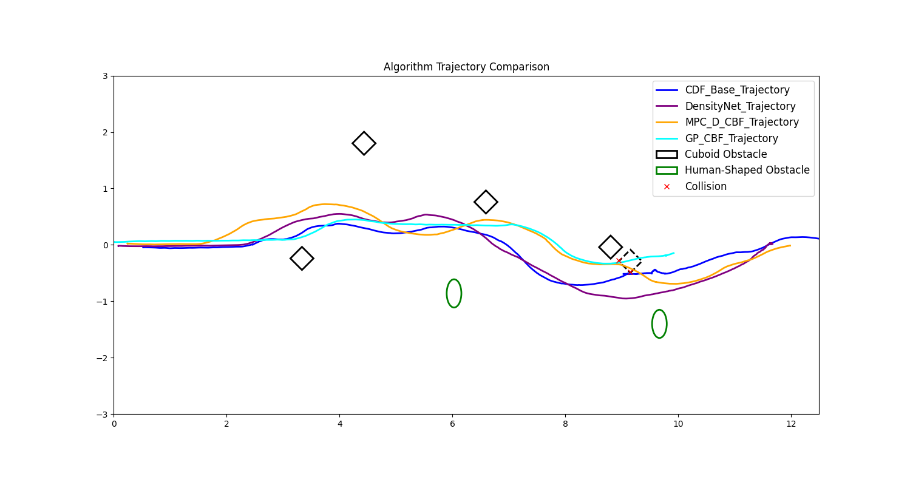

# DensityNet
This repository is the companion code for paper <DensityNet: Learning Control Density Function for End-to-End Safe Navigation in Unknown Environments>, which has been submitted to RA-L. This code includes the generation of the dataset, the training of the network, and the code for physical experimental validation (CDF-Base, GP-CBF, DensityNet). The main part of the code is located in the "sensor_cdf" folder.

## Robot Model Diagram

We employ the Hunter SE mobile robot developed by AgileX, which operates using differential drive. The robot is equipped with an onboard computer featuring an Intel i7-1165G7 CPU and an NVIDIA RTX 2060 GPU, along with an Ouster S1-128 LiDAR sensor.

## The Constructino of Neural Network

In our graph neural network, each point in the input point cloud is represented as a node with 2D coordinates $[p_x, p_y]$ as features. Edges are dynamically constructed via KNN, with edge features defined as the relative coordinate difference $e_{ij} = p_j - p_i$ to capture local geometry. The geometric branch uses a multi-scale graph encoder with Dynamic Edge Convolution and graph attention layers, while the state branch encodes the robot’s dynamic state using a lightweight MLP. The outputs of both branches are concatenated and passed through a fusion module to model cross-modal interactions, before a lightweight prediction head generates control commands. This architecture enables robust and efficient integration of geometric and dynamic information, suitable for high-frequency control in unknown and dynamic navigation environments.

The following table is the size of layers in the network and training hyperparameters, which also can be found in our codes.


## Details of generating the training set
During trajectory generation, we leverage global information to compute the CDF over randomly generated obstacles. Using a time step of $ΔT = 0.05s$ and a Go-to-Goal nominal controller, the control input is obtained by solving QP problem (6) and used to update the robot's position. Since the resulting single-integrator trajectory doesn't match real differential-drive vehicle constraints, we apply the Euler-Cromer method to generate smooth, physically feasible motions suitable for actual robot deployment. The resulting trajectory comparison as below.


## Result 





## Installation
The code was tested on Hunter-SE robot with ubuntu20.04, python3.12 and Ros1.
```
# clone project
git clone https://github.com/geermansipaluo/L-CDF
```

## Run the Codes
### Expert Data Generation
The "scene.py" file is used to generate the dataset. It defines the specific parameters of the simulation environment in detail, including the field size, the number and size of obstacles, and the start and end positions. The final dataset will be saved in the "output" folder.
```
cd src/sensor_cdf/scripts
python3 scene.pyl
```

### Train the Model 
"model.py" defines the specific structure and parameters of the network, while "train_pc.py" uses the dataset generated by "scene.py" to train an end-to-end network and saves it in the "saved_model" folder.
```
cd src/sensor_cdf/scripts
python3 train_pc.py
```

### Physical Experimental Validation
In "train_cdf.launch", you can choose to launch different physical validation methods (including DensityNet, GP-CBF, and CDF-Base) by commenting out other sections and uncommenting the code of the algorithm you wish to start. However, please note that the convert_pointcloud2d node must not be uncommented. Since the MPC-D-CBF method is open-source, it is not listed here.
```
# 1.Establish communication between the onboard computer and the chassis, and launch the chassis control node.
e.g. sudo modprobe gs_usb
sudo ip link set can0 up type can bitrate 500000
roslaunch hunter_bringup hunter_robot_base.launch

# 2. Start the corresponding node according to your LiDAR model.
e.g. roslaunch ouster_ros sensor.launch

# 3. Launch the SLAM algorithm for localization.
e.g. roslaunch direct_lidar_inertial_odometry dlio.launch

# 4. Launch the control algorithm.
roslaunch sensor_cdf train_cdf.launch
```

